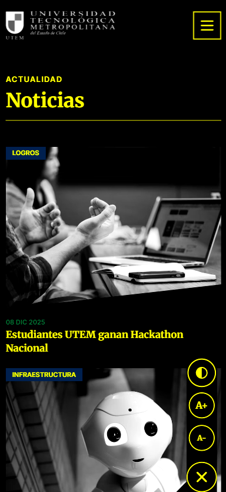

# Landing Page Ingeniería en Informática - UTEM

Este proyecto consiste en el desarrollo de una Landing Page moderna, responsiva y accesible para la carrera de Ingeniería en Informática de la Universidad Tecnológica Metropolitana (UTEM).

El sitio ha sido construido utilizando **Astro** como framework de arquitectura y **Tailwind CSS** para el sistema de diseño, cumpliendo con los estándares de rendimiento y buenas prácticas de desarrollo web moderno.


## 🚀 Tecnologías Utilizadas

* **Astro (v5.x):** Framework web para contenido estático de alto rendimiento.
* **Tailwind CSS (v3.4):** Framework de utilidades CSS para diseño responsivo.
* **TypeScript/JavaScript:** Lógica de interactividad en el cliente.
* **HTML5 Semántico:** Estructura base accesible.

## 📋 Requerimientos del Proyecto

El desarrollo cumple con los siguientes puntos evaluados:

1.  **Correctitud Técnica:** Estructura modular basada en componentes `.astro` y uso exclusivo de Tailwind para estilos.
2.  **Diseño Responsivo:** Adaptabilidad total desde dispositivos móviles (Mobile First) hasta pantallas de escritorio.
3.  **Accesibilidad:** Inclusión de un widget de accesibilidad (Aumento de fuente, Alto contraste) y navegación semántica.
4.  **Identidad Corporativa:** Uso estricto de la paleta de colores y tipografías institucionales de la UTEM.

## 📱 Responsividad y Diseño Mobile First

El sitio ha sido diseñado pensando primero en la experiencia móvil, asegurando que la navegación y el contenido sean fluidos en pantallas pequeñas.


*Captura de la pantalla de inicio en versión móvil.*

## ♿ Accesibilidad y Alto Contraste

Se ha implementado un widget de accesibilidad flotante que permite a los usuarios ajustar el tamaño del texto y activar un modo de **Alto Contraste** para mejorar la legibilidad.



*Visualización del sitio con el modo de Alto Contraste activado.*

## 🎓 Secciones Destacadas

### Propuesta de Valor y Características
Sección diseñada para resaltar los pilares fundamentales de la carrera: Empleabilidad, Perfil Tecnológico y Sello Social.


### Equipo Académico
Presentación de las autoridades de la escuela con un diseño limpio y profesional, adaptado a dispositivos móviles.


## 📂 Estructura del Proyecto

La organización del código sigue una arquitectura basada en componentes:

```text
/
├── public/             # Archivos estáticos (imágenes, logos, favicon)
├── src/
│   ├── components/     # Bloques de UI reutilizables
│   │   ├── Accessibility.astro  # Widget flotante de accesibilidad
│   │   ├── Features.astro       # Sección de características y propuesta de valor
│   │   ├── Footer.astro         # Pie de página con créditos y contacto
│   │   ├── Header.astro         # Navegación y menú móvil
│   │   ├── Hero.astro           # Carrusel principal y CTA
│   │   ├── News.astro           # Grilla de noticias estilo Waseda
│   │   └── Video.astro          # Integración de video institucional
│   ├── layouts/
│   │   └── Layout.astro         # Estructura HTML base y Pantalla de Intro
│   └── pages/
│       └── index.astro          # Página principal (punto de entrada)
├── astro.config.mjs    # Configuración del framework
├── tailwind.config.mjs # Configuración de temas y colores UTEM
└── package.json        # Dependencias del proyecto
```

## 🛠️ Instalación y Despliegue

Sigue estas instrucciones para ejecutar el proyecto en un entorno local.

### Prerrequisitos
* **Node.js** (v18.14.1 o superior).
* **npm** (gestor de paquetes).

### Pasos

1.  **Clonar el repositorio** (si aplica) o descargar el código fuente.

2.  **Instalar dependencias:**
    Abrir una terminal en la raíz del proyecto y ejecutar:
    ```bash
    npm install
    ```

3.  **Ejecutar servidor de desarrollo:**
    ```bash
    npm run dev
    ```
    El sitio estará disponible en `http://localhost:4321`.

4.  **Compilar para producción (Build):**
    Para generar la carpeta `dist/` lista para subir a un servidor:
    ```bash
    npm run build
    ```

## 👥 Créditos y Equipo

**Desarrollador:**
* **Ignacio Alvarado Toledo**
* *Roles:* Full Stack Developer, UI/UX Designer, Frontend Architecture.
* *Carrera:* Ingeniería en Informática, UTEM.

**Asignatura:**
* **Nombre:** EFE: Computación Móvil (EFE68500).
* **Docente:** Sebastián Salazar Molina.
* **Fecha de Entrega:** 9 de Diciembre 2025.

---
*Proyecto desarrollado con fines académicos para la Universidad Tecnológica Metropolitana.*